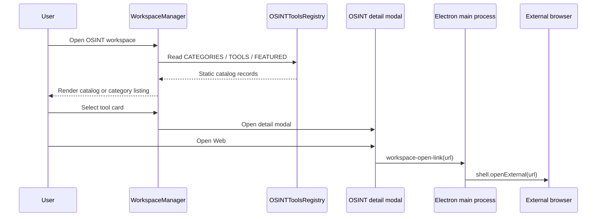
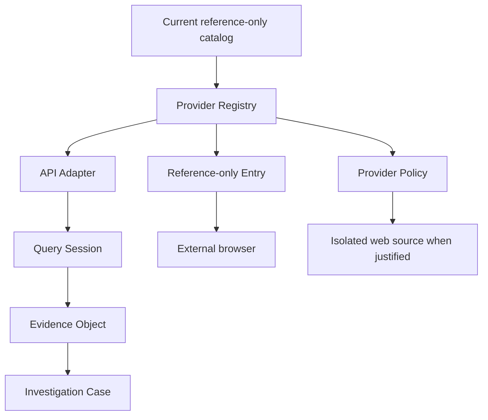

# OSINT Component Map

## Active component map

| File | Role | Status in current runtime | Notes |
| --- | --- | --- | --- |
| `src/config/workspaces.config.js` | Defines the OSINT top-level workspace | active | Provides the workspace identity and navigation configuration. |
| `src/ui.html` | Loads OSINT browser-side registry | active | Loads `classes/workspaces/osintTools.registry.js` into the renderer. |
| `src/classes/workspaceManager.class.js` | Renders catalog, category list and detail modal | active | `renderOSINT`, `renderOSINTState`, `openOSINTToolById`, `openOSINTDetail` and close behavior own the visible OSINT experience. |
| `src/classes/workspaces/osintTools.registry.js` | Static catalog registry | active | 9 categories, 161 tools, 4 featured IDs, direct URLs and tags. |
| `src/assets/css/workspaces.css` | OSINT catalog and modal styling | active | Also contains legacy analyst-deck styles. |
| `src/_boot.js` | External-link IPC and legacy OSINT main-process handlers | partially active | `workspace-open-link` is active; isolated-source and native-query handlers are dormant with the current registry. |
| `scripts/test-osint-workspace.js` | Validates active catalog shape | active | Passes against current registry/renderer contract. |

## Legacy / disconnected component map

| File | Role | Current relationship | Baseline finding |
| --- | --- | --- | --- |
| `src/classes/workspaces/osintAccess.class.js` | Earlier analyst deck with native query and isolated source overlays | not instantiated by current workspace renderer | Expects a richer registry API that no longer exists. |
| `src/_boot.js` isolated source helpers | Owns `WebContentsView`, allowlisting, layout and close lifecycle | not reachable from current catalog cards | Security design is retained, but no active card can resolve an embedded source. |
| `scripts/test-osint-native-access-foundation.js` | Validates old provider/embedded model | out of sync | Calls `getToolsForCategory()` which is absent in current registry. |

## Current UI and event flow

## OSINT registry inventory

| Registry field | Current value | Intended meaning today |
| --- | --- | --- |
| `CATEGORIES` | 9 entries | Catalog navigation groups. |
| `TOOLS` | 161 entries | Reference-only, externally opened sources. |
| `FEATURED` | 4 IDs | Cards on catalog home. |
| `id` | required, unique | Tool identity used by card/detail lookup. |
| `title` | required | User-facing name. |
| `category` | required | One of the nine catalog categories. |
| `icon` | present | Compact cockpit glyph. |
| `url` | required | Direct external source URL. |
| `description` | present | Short reference description. |
| `tags` | required | Source context, shown in catalog/detail. |

Not present in the active schema: provider identity, access mode, allowlist, request policy, query schema, evidence schema, authentication handling, local session state or investigation-case references.

## Current `TOOL ACCESS` panel

The category view renders a static `TOOL ACCESS / EXTERNAL` explanatory aside. It currently contains category guidance and tags only. It has no selected-tool state, no provider availability, no live query, no evidence list and no persistent session.

## Current modal

`openOSINTDetail(tool)` dynamically creates/reuses `#osint_tool_detail_overlay` and presents:

- Tool icon, category and title.
- Fixed `EXTERNAL SOURCE` state.
- Access / domain / tag readouts.
- Direct source URL.
- `OPEN WEB`, `COPY URL`, `CLOSE` actions.

The current close action removes visible state and preserves the category listing. No data is written to userData or repository as part of the current modal behavior.

## URL, browser and webview boundaries

| Surface | Current behavior | Security/ownership |
| --- | --- | --- |
| Tool card → detail | renderer-local | Tool ID resolved against static registry. |
| Detail → browser | active | Typed `workspace-open-link` IPC opens URL externally. |
| Legacy isolated source | dormant | Main-process `WebContentsView` with sandbox/context isolation/permissions denied and a dedicated session. |
| Native provider query | dormant | Main-process `osint-native-query` supports the old Wayback Availability path. |

## Tests

| Test | Contract checked | Baseline status |
| --- | --- | --- |
| `scripts/test-osint-workspace.js` | Active catalog/renderer shape | PASS |
| `scripts/test-osint-native-access-foundation.js` | Legacy provider/embedded contract | FAIL: test and active registry API diverged |
| `scripts/run-regression-checks.js` | Aggregated project checks | Non-zero because of existing legacy OSINT test drift and clean-worktree private-bootstrap expectation |
| `scripts/release-health-check.js` | Release/protected-data health | PASS |

## Protected extension map

Any implementation following this map must remain OSINT-scoped, typed, policy-controlled and opt-in. It must not make global runtime, branding, intro, map, assistant, music or private-memory changes.
