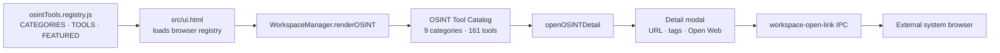
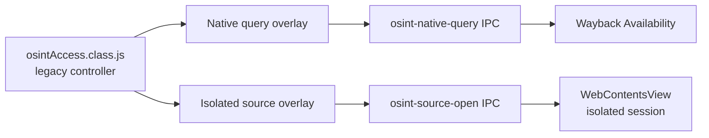

# Current OSINT Architecture

## Executive finding

The current OSINT experience has two overlapping generations of architecture:

1. **Active catalog path** — the path the user sees today. It renders 161 reference-only public sources from a simple browser-side registry and opens each URL externally.
2. **Dormant native-access path** — an earlier provider and isolated-webview implementation still present in source, including Electron IPC and a secure `WebContentsView` surface. Its registry API no longer matches the current catalog, so the active renderer cannot reach it.

Phase 0 changes neither path. It records the boundary so a later implementation can replace it deliberately.

## Active path: catalog and external browser

### Active data contract

`src/classes/workspaces/osintTools.registry.js` exports a frozen object with:

- `CATEGORIES`: category ID, title, description, icon and accent metadata.
- `TOOLS`: `id`, `title`, `category`, `icon`, `url`, `description` and `tags`.
- `FEATURED`: IDs used by the catalog home screen.

There is no active `accessMode`, `providerId`, provider-policy metadata, evidence model, query schema or local result model in this contract.

### Active renderer behavior

`WorkspaceManager.renderOSINT()` and `renderOSINTState()` own the visible catalog. They render:

- OSINT catalog home, category tiles and featured cards.
- Category listings.
- The static category-side `TOOL ACCESS` panel.
- A compact tool-detail dialog with a direct URL, tags and external browser action.

All visible cards and detail dialogs label tools as external sources. The current side panel is explanatory only; it does not retain tool selection, query state, evidence or results.

## Dormant path: native provider and isolated source surface

The old controller expects richer registry methods and records such as:

- `getToolsForCategory()`.
- `getTool()` and `getEmbeddedTool()`.
- `accessMode: native_api | embedded_web`.
- `providerId`, allowed host data and native query metadata.

The current registry does not expose those methods or fields. As a result:

- `_boot.js#getOsintSource()` returns `null` for current catalog IDs.
- `osint-source-open` currently cannot open a registered in-suite source.
- `osintAccess.class.js` is not instantiated by the active `WorkspaceManager` OSINT rendering path.
- `test-osint-native-access-foundation.js` fails before its intended security assertions because it calls the removed `getToolsForCategory()` API.

### Security properties retained in the dormant Electron implementation

The dormant isolated-surface code is a useful security reference, but is not active functionality today:

- `WebContentsView` with `nodeIntegration: false`.
- `contextIsolation: true`.
- `sandbox: true` and `webSecurity: true`.
- `webviewTag: false`.
- No permission grants through its dedicated persisted session.
- Source allowlisting and external-browser fallback for off-allowlist navigation.

## Current IPC inventory

| IPC handler | Current state | Consumer / outcome |
| --- | --- | --- |
| `workspace-open-link` | active | Current OSINT detail modal uses it to open an external URL. |
| `osint-source-open` | dormant / incompatible | Depends on `getEmbeddedTool()`, absent from the active registry. |
| `osint-source-layout` | dormant | Layout API for a `WebContentsView` that the catalog never opens. |
| `osint-source-reload` | dormant | Reloads a currently opened legacy isolated source only. |
| `osint-source-close` | dormant | Closes the legacy isolated source view only. |
| `osint-native-query` | dormant but implemented | Wayback Availability request path; no active catalog UI invokes it. |

## Code duplication, hardcoding and coupling

### Duplication / drift

- Two renderer concepts coexist: the current catalog in `workspaceManager.class.js` and the legacy analyst deck in `osintAccess.class.js`.
- Two mutually incompatible registry assumptions coexist: static `CATEGORIES/TOOLS/FEATURED` versus rich provider methods.
- OSINT CSS contains styles for both generations. This is not harmful by itself, but it obscures the active contract.

### Hardcoded values

- Current tool titles, URLs, tags, category labels and featured IDs are hardcoded declarative catalog values. That is appropriate for a reference-only directory, but not enough for provider status, evidence handling or policy.
- Current visible `EXTERNAL` labels are hardcoded in catalog cards, tool detail and the side panel.
- Legacy controller status readouts hardcode `1 PROVIDER` and `8 WEB SOURCES`; they no longer describe the active 161-tool catalog.
- The legacy main-process path hardcodes the Wayback Availability provider and source-session identifier.

### Coupling

- Active OSINT rendering is coupled to global browser `window.OSINTToolsRegistry` loading in `src/ui.html`.
- The current renderer is coupled to shared `WorkspaceManager` DOM composition and shared workspace CSS.
- Legacy embedded-source behavior is coupled to Electron main-process view ownership and IPC in `_boot.js`.
- No active OSINT component currently depends on HUB, ENG, map, Apple Music, Calendar, Assistant or private memory. This is a safe boundary to preserve.

## Target architecture vocabulary

The following is the intended vocabulary for subsequent phases. It is a design boundary, not implemented runtime behavior in Phase 0.

| Element | Responsibility |
| --- | --- |
| **Workspace** | The OSINT UI shell: navigation, presentation state and user-directed actions. It never grants provider privileges by itself. |
| **Capability** | A narrowly defined user-facing operation, such as archive lookup, public domain context, geo reference or reference-only browser access. |
| **Provider** | A concrete implementation of a capability: local query adapter, external browser reference, or isolated remote-source surface. |
| **Provider Registry** | Versioned declarative record of providers, capabilities, availability, policy and UI metadata. It replaces incompatible parallel registry contracts. |
| **Provider Policy** | Explicit rules for allowed hostnames, request limits, browser-only handling, authentication requirements, data retention and capability scope. |
| **Evidence Object** | Local structured citation metadata: source, URL, time, query/session provenance, capture reference and confidence note. It is not raw private browsing history. |
| **Investigation Case** | A user-created local container that groups question, evidence and findings. It must remain private and outside Git. |
| **Query Session** | A bounded, user-directed execution record: provider, input, timestamp, outcome and optional evidence references. |
| **API Adapter** | The smallest provider-specific boundary that normalizes public API responses and exposes no arbitrary network or shell access to the renderer. |
| **Reference-only Entry** | A catalog entry that deliberately opens a public resource externally and does not claim native integration, querying or evidence capture. |

## Safe extension points

1. Add a new OSINT-only provider registry and adapter namespace without replacing the working reference catalog at once.
2. Model each existing tool first as `reference_only`; promote individual tools only after their provider policy and adapter exist.
3. Build a dedicated side-panel state controller for selection, provider status and evidence previews instead of expanding the static `TOOL ACCESS` text in place.
4. Keep Electron isolated-source ownership in the main process and expose only allowlisted, typed IPC methods.
5. Store future cases, sessions and evidence in userData with explicit export controls, never in the repository or current global configuration.
6. Retire or reconcile the old `osintAccess.class.js` only after replacement behavior is tested—not by deleting it during a discovery phase.
