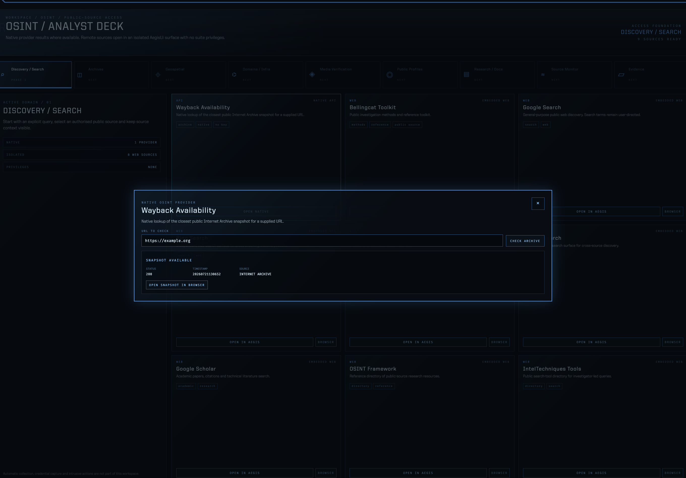
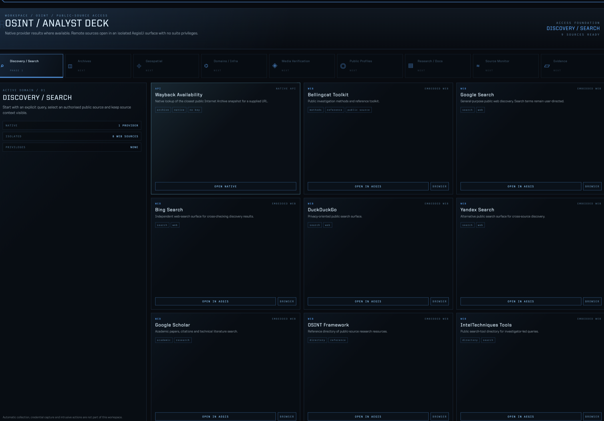

# AegisUi v2.3.0 — OSINT native access foundation

## First native OSINT phase

This release turns the OSINT workspace from a visual catalogue into a controlled
access surface. It deliberately starts with **Discovery / Search** rather than
pretending that every planned domain is already integrated.

### Native provider

**Wayback Availability** is the first cockpit-native provider. A user enters a
public URL; AegisUi calls Internet Archive's availability endpoint locally and
renders the closest public snapshot status, timestamp and explicit browser
handoff. It stores no third-party key and does not run in the background.

### Isolated public-source views

The following Discovery/Search resources can now open inside AegisUi:

- Bellingcat Toolkit
- Google, Bing, DuckDuckGo and Yandex Search
- Google Scholar
- OSINT Framework
- IntelTechniques Tools

Each source runs in its own sandboxed Electron `WebContentsView`, with Node
integration disabled, context isolation enabled, permissions denied and a
per-source HTTPS host allowlist. A visible external-browser action remains
available as an explicit fallback.

## Security and scope

- No scraping, credential capture, background collection or intrusive actions.
- No third-party API keys were added.
- Planned OSINT domains are visible but are not claimed as active integrations.
- The embedded source surface has no AegisUi filesystem, command-router or
  renderer privileges.

## Validation performed

- `scripts/test-osint-native-access-foundation.js` passed.
- `scripts/release-health-check.js` passed with version and privacy checks.
- Packaged app opened as `EdexUi-Eng v2.3.0`.
- Packaged Wayback query for `https://example.org` returned `SNAPSHOT AVAILABLE`
  and an HTTPS Internet Archive link.
- Packaged Bellingcat Toolkit source opened in the isolated in-suite view and
  reported `READY`; closing it and returning to HUB removed the source view.
- The regression aggregator completed with a single external-provider warning:
  AISStream produced no message during its bounded WebSocket test window. That
  source was not modified in this release, and the warning is reported rather
  than hidden.

## Package

- Product: `EdexUi-Eng`
- Bundle ID: `com.edex.ui.eng`
- Version: `2.3.0`
- Local macOS asset: `EdexUi-Eng-2.3.0-arm64.dmg`

The DMG is ad-hoc signed locally. This release does not claim Apple
notarization.
