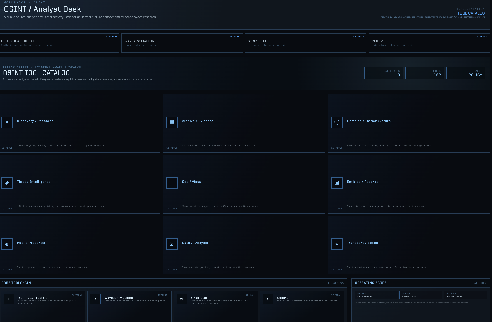

# AegisUi v2.3.3 — OSINT Provider Registry and Transparent Reference Policy

This release replaces the informal OSINT tool list with one validated provider registry. The active catalog now derives its categories, counts, featured cards, filters and launch permissions from that single source of truth.

## What changed

- Migrated the existing 161 legitimate catalog entries without changing their normal external-launch behavior.
- Added explicit provider type, access mode, status, risk, legal-context, confidence and review metadata.
- Added schema validation and a central launch policy.
- Added one carefully bounded `REFERENCE ONLY` example to demonstrate transparent ecosystem awareness without operational access.
- `REFERENCE ONLY` entries can be read, but have no actionable URL, launch, copy, installation, configuration, API or integration route.
- Left the legacy isolated OSINT runtime, its `WebContentsView`, `osint-source-*` IPC and `osint-native-query` disconnected and documented for a later Provider Runtime phase.

## Visual record

### Normal catalog

### Reference-only detail

## Validation note

All registry, policy, workspace and privacy checks pass in the clean worktree. The general map-provider script remains environment-limited because its TomTom key returns HTTP 401 and no local AISStream key is configured; this pre-existing configuration condition is not changed by v2.3.3.
